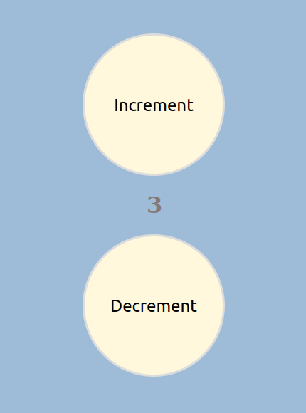

# ReactPractice
Repo for all react practice projects

# 1.Hello_World_CDN
First react application using CDN

# 2.Simple_React_SPA
Single Page React application
Has minimal data and Styling, learnt to create functional components and separate them accordingly.

# 3.Digital Bussiness Card SPA
Simple SPA for creating my profile as bussiness card as shown
 
 

# 4.SneakersProject_Props
Sneakers store project which uses the concept of React Props
work in progress . . .

# 5.State_IncDec
React app to increment and decrement a variable using the concept of React State.
 
 

